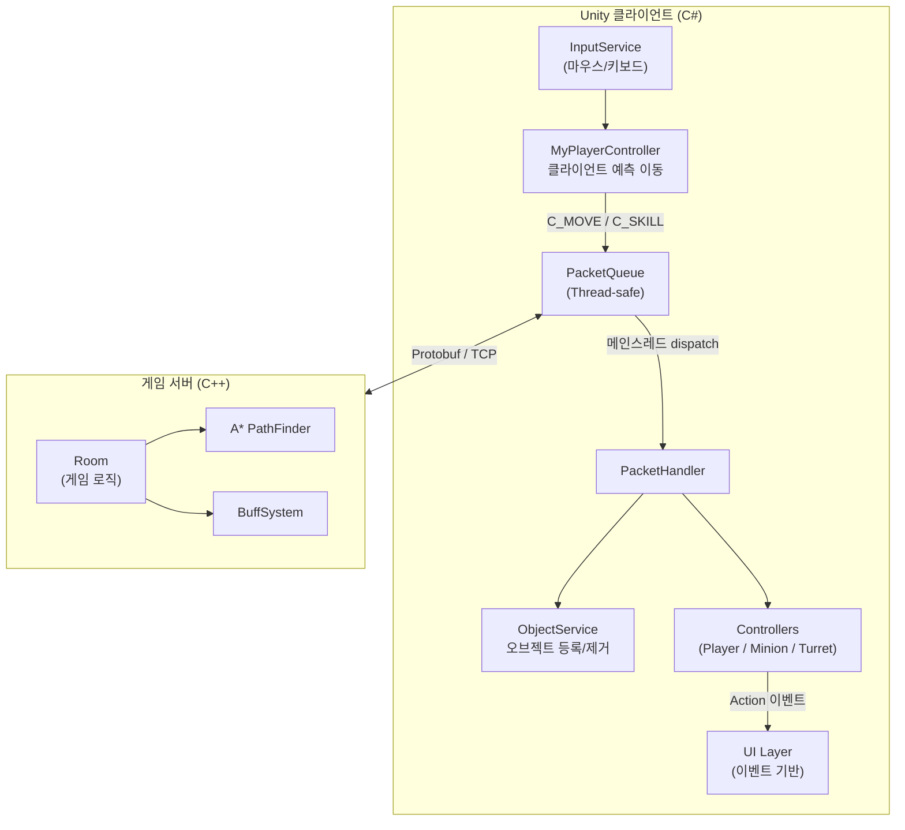
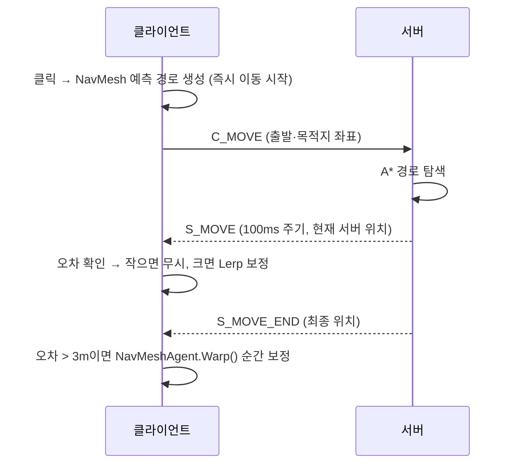

# GW2 — Multiplayer RTS/MOBA


> Unity C# 클라이언트 + C++ IOCP 게임 서버로 구성된 **서버 권위(Server-Authoritative) 멀티플레이어 게임** 1인 개발 프로젝트

---

## 🎮 게임플레이 미리보기 : 아래 이미지 클릭시 시연 영상 재생

[](https://www.youtube.com/watch?v=nmPksJASpEs)

---

## 📋 프로젝트 개요

| 항목 | 내용 |
|------|------|
| **장르** | 멀티플레이어 RTS/MOBA |
| **개발 형태** | 1인 풀스택 (클라이언트 + 서버 전담), 졸업작품 기반 재개발 |
| **개발 기간** | 2025.12 ~ 2026.05 |
| **최대 플레이어** | 4명 동시 접속 |

---

## 🛠 기술 스택

| 구분 | 기술 |
|------|------|
| **클라이언트** | Unity 2022, C#, NavMesh, TextMeshPro, Protobuf |
| **서버** | C++17, WinSock2 IOCP, Protobuf, A\* PathFinding, JobQueue |
| **공통** | Google Protocol Buffers (IDL 기반 패킷 직렬화) |
| **네트워크** | TCP, 커스텀 PacketQueue (멀티스레드 → 메인스레드 안전 전달) |

---

## 🏗 시스템 아키텍처

### 전체 구조



### 서버 권위 이동 흐름



---

## 🔍 핵심 구현

### 1. 클라이언트 예측 + 서버 보정

`NavMeshAgent.updatePosition = false` 로 NavMesh 장애물 회피는 유지하면서 위치는 서버 패킷 기준으로 수동 제어합니다. 클릭 즉시 클라이언트에서 예측 경로로 이동을 시작하고, `S_MOVE_END` 수신 시 오차가 임계값을 초과하면 `NavMeshAgent.Warp()`로 보정합니다.

```csharp
// 클릭 즉시 NavMesh 예측 경로 생성 + 서버 패킷 전송을 동시에
public void RequestMove(Vector3 worldPosition)
{
    StartMovePrediction(worldPosition); // 클라이언트 즉시 이동
    SendMovePacket(worldPosition);      // 서버에 이동 요청
}
```

```csharp
// S_MOVE_END 수신 — 오차가 크면 순간 이동으로 즉시 복구
float differ = Vector3.Distance(myPlayer.transform.position, serverPos);
if (differ > 3.0f)
    agent.Warp(serverPos);
```

---

### 2. 미니언 서버 경로 추종 (NavPath)

서버 A* 결과를 `S_MINION_MOVE`로 waypoint 배열로 수신합니다. 이동 중 S_MOVE 100ms 주기 Lerp 보정은 진동 버그를 유발하므로 비활성화하고, 오차가 스냅 임계값을 넘을 때만 순간 이동 보정을 적용합니다.

```csharp
private void ApplyServerCorrection()
{
    float err = Vector3.Distance(transform.position, _serverRefPos);
    if (err >= _snapDistance)
    {
        transform.position = _serverRefPos;
        _navIndex = FindNearestForwardWaypointIndex(_serverRefPos, _navPath, _navIndex);
    }
    // 이동 중 Lerp 보정 제거 — 정상 오차는 무시
}
```

---

### 3. Thread-safe 패킷 큐

Unity API는 메인 스레드에서만 호출 가능하므로 네트워크 수신 스레드와 게임 로직 스레드를 분리합니다.

```
[IOCP 수신 스레드] → PacketQueue.Push() (lock)
                               ↓
[메인 스레드] Update() → PacketQueue.PopAll() → PacketHandler 처리
```

```csharp
// NetworkService.Update() — Bootstrapper.Update()에서 매 프레임 호출
public void Update()
{
    List<PacketMessage> list = PacketQueue.Instance.PopAll();
    foreach (PacketMessage packet in list)
        handler.Invoke(_session, packet.Message);
}
```

---

### 4. 서버 권위 버프 시스템 + 이벤트 기반 UI

버프 수치 계산은 서버에서만 수행합니다. 클라이언트는 `S_BUFF_APPLIED` 수신 후 이동속도 즉시 반영(예측 이동 동기화)과 UI 표시만 담당합니다. UI와 로직의 결합을 없애기 위해 `static Action` 이벤트를 사용하며, UI 생성 전 패킷 도착에 대비한 `_pendingStatInfo` 버퍼 패턴을 적용했습니다.

```
S_BUFF_APPLIED 수신
    → BaseController.ApplyBuff()
        → BuffSpeed: 클라이언트 _moveSpeed 즉시 적용 (예측 이동 동기화)
        → BuffAttack / BuffDefense: 서버 계산, 클라이언트는 UI 표시만
    → MyPlayerController.OnBuffApplied (static Action)
        → UI_StatusBox.HandleBuffApplied() → Refresh()
```

---

## 📁 프로젝트 구조

```
Assets/Scripts/
├── Controllers/
│   ├── BaseController.cs          # 애니메이션, 이동, HP, 버프 기반 클래스
│   ├── MyPlayerController.cs      # 클라이언트 예측 이동, 입력 처리
│   ├── PlayerController.cs        # 원격 플레이어 서버 위치 보간
│   ├── MinionController.cs        # 서버 NavPath 경로 추종
│   ├── TurretController.cs
│   └── NexusController.cs / BaronController.cs
│
├── Services/
│   ├── Contents/
│   │   ├── ObjectService.cs       # 게임 오브젝트 생성·제거·조회 레지스트리
│   │   └── NetworkService.cs      # TCP 연결, PacketQueue dispatch
│   └── Core/
│       ├── UIService.cs           # Popup/Scene UI 관리, sorting order
│       ├── InputService.cs        # 마우스·키 이벤트 단일 진입점
│       └── ResourceService.cs / DataService.cs / ...
│
├── Packet/
│   ├── PacketHandler.cs           # 패킷 ID → 핸들러 라우팅
│   ├── PacketQueue.cs             # Thread-safe 패킷 큐
│   └── ServerPacketHandler.cs     # PacketManager 등록
│
├── UI/
│   ├── UI_Base.cs                 # Enum 기반 컴포넌트 바인딩 패턴
│   ├── Scene/ Popup/ SubItem/ WorldSpace/
│   └── SubItem/UI_StatusBox.cs    # 버프 이벤트 수신 → 스탯 표시
│
├── DI/
│   ├── Bootstrapper.cs            # 싱글톤 서비스 컨테이너 (DontDestroyOnLoad)
│   └── DIContainer.cs             # Reflection 기반 커스텀 DI 구현체
│
└── ServerCore/
    ├── Session.cs                 # IOCP 기반 비동기 TCP 세션
    └── RecvBuffer.cs
```

---

## ▶️ 실행 방법

### 서버 빌드 및 실행

```bash
# Visual Studio 2022 에서 GW2_Server.sln 열기
# Release x64 빌드 후 실행
GW2_Server.exe
# 기본 포트: 7777
```

### 클라이언트 실행

```
1. Unity 2022.x 에서 GW2_Client 프로젝트 열기
2. Assets/Scenes/LoginScene 실행
3. 서버 IP는 Assets/Resources/config.json 에서 설정
```

> 서버와 클라이언트를 동일 네트워크에서 실행하거나, 서버 IP를 `127.0.0.1`로 설정하면 로컬 테스트가 가능합니다.
